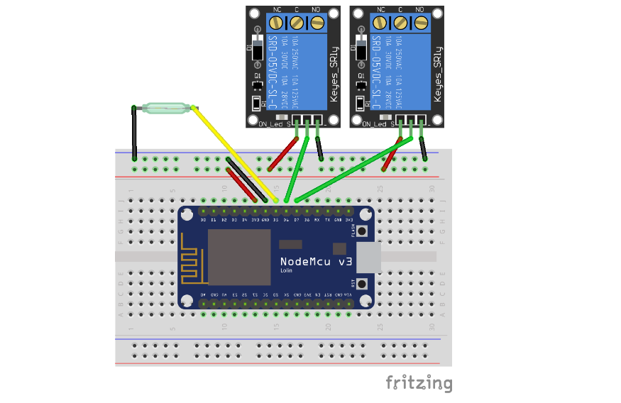

# COFFEEino
Управление кофе машиной по протоколу MQTT

## Hardware
* ESP8266 NodeMCU v3
* Модуль на 2 реле
* Герконовый датчик уровня воды

## Software
Arduino IDE 1.8.1+ с поддержкой esp8266 2.3.0+ и установленными библиотеками:
* PubSubClient
* ESP8266WiFi
* ArduinoOTA

## Подключение


## Интеграция с Home-assistant
```yaml
script:
  coffee:
    sequence:
    - service_template: >
        
          notify.push
        
      data:
        message: "Недостаточно воды в кофеварке."
    - condition: state
      entity_id: binary_sensor.coffee_water_level
      state: 'on'
    - service: switch.turn_on
      data:
        entity_id: switch.coffee_power
    - delay: 00:02:00
    - service: switch.turn_on
      data:
        entity_id: switch.coffee_water
    - delay: 00:00:30
    - service: switch.turn_off
      data:
        entity_id: switch.coffee_water
    - delay: 00:00:03
    - service: switch.turn_off
      data:
        entity_id: switch.coffee_power

binary_sensor:
  - platform: mqtt
    state_topic: "home/stat/coffee_water_level"
    name: coffee_water_level
    qos: 0
    payload_on: 1
    payload_off: 0
    
switch:
  - platform: mqtt
    name: coffee_power
    state_topic: "home/stat/coffee_power"
    command_topic: "home/cmnd/coffee_power"
    payload_on: "1"
    payload_off: "0"
    retain: true
  - platform: mqtt
    name: coffee_water
    state_topic: "home/stat/coffee_water"
    command_topic: "home/cmnd/coffee_water"
    payload_on: "1"
    payload_off: "0"
    retain: true
```
